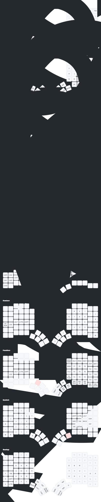

# Custom Glove80 ZMK Configuration

This is my layout for MoErgo's Glove80 board.

## Keys used (34):

## Layout

Base layer is using Colemak-DH alphas with a slight change based on Manna Harbour's [Miryoku](https://github.com/manna-harbour/miryoku), which is replacing `;` at top right pinky with `'`. It's highly inspired by [Seniply](https://github.com/stevep99/seniply) and [casuanoob](https://github.com/casuanoob/zmk-config-bkb) layouts.
To use this as-is, one would need to install [Karabiner](https://karabiner-elements.pqrs.org/) or any other software to remap f13 and f14 keys. F13 is mapped to Apple globe key, F14 is a combination of CMD+SHIFT+OPT+CTRL.

